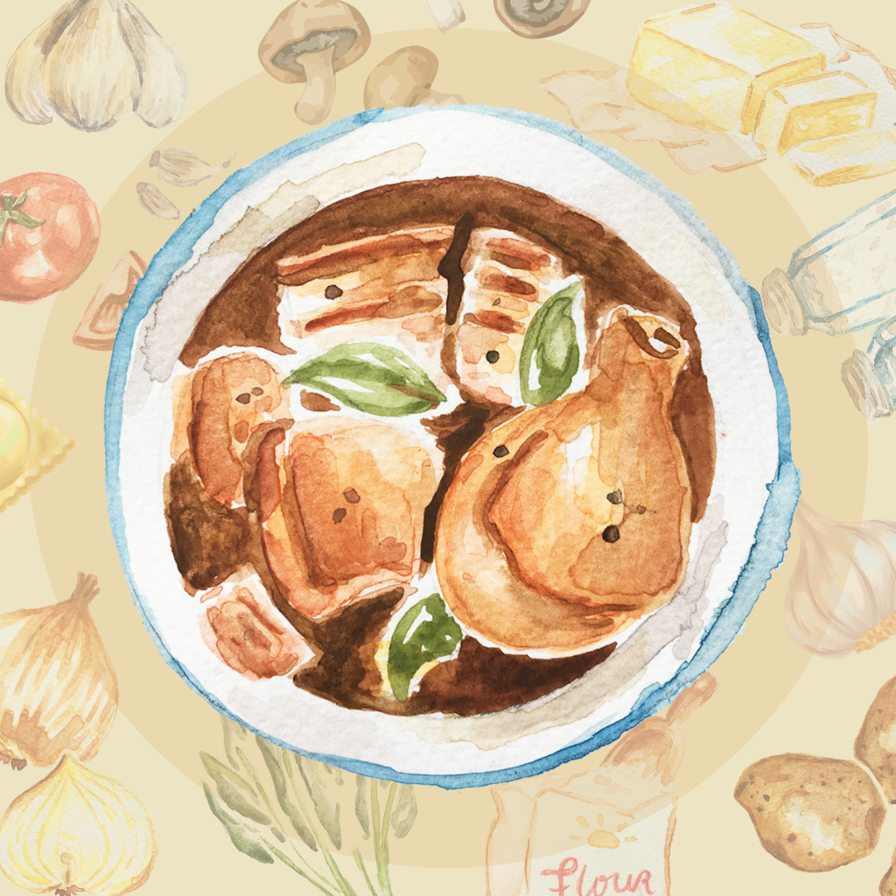
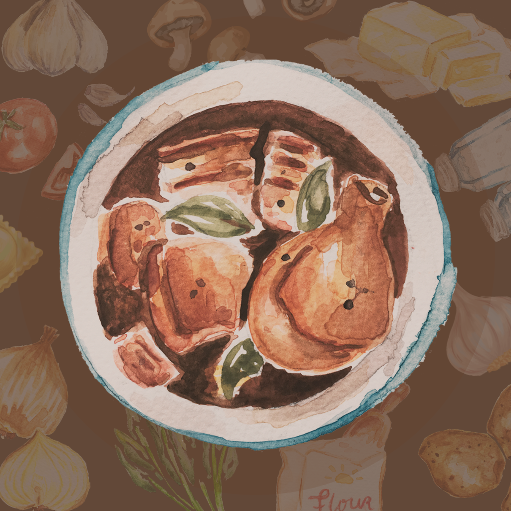

#  RecipeVault iOS App

A simple SwiftUI-based recipe app that fetches and displays recipes from an API. Users can switch between **list view** and **grid view**, refresh recipes, and enjoy smooth image caching for a seamless experience.

## Summary
- Fetches recipes from the provided API
- Displays recipes in List View and Grid View with a toggle
- Supports pull-to-refresh
- Dark Mode Support for a seamless experience in both light and dark themes
- Handles malformed and empty data

## Media

### **App Icons** (Light/Dark)
 

### **Screenshots** - Light Mode
 

### **Screenshots** - Dark Mode
 

### **Demo Video**
[Link to the video](https://github.com/kaurtanpreet/RecipeVault/blob/main/Media/RecipeVault-Demo.mp4)

## Focus Areas

* Clean Architecture
    - Used MVVM for better separation of concerns.
    - Kept `ContentView` clean by delegating UI logic to separate components.
* Swift Concurrency with `async/await`
    - Used `async/await` for fetching recipes and loading images to ensure smooth performance.
    - No third-party libraries, only Apple's built-in frameworks.
* Image Caching
    - Implemented a caching system to avoid unnecessary image downloads.
    - Verified caching through unit tests.
* Error Handling & Edge Cases
    - Handled malformed data by discarding all recipes.
    - Displayed user-friendly messages for empty results or API failures.

## Time Spent

- Designing and Planning: 30-45 mins
- Implementation: 4.5 hours
- SwiftUI UI Design: 1.5 hours
- Unit Testing & Debugging: 1.5 hours
- App Icons: 30-45 mins
- **Total Time**: ~8.5 hours

## Trade-offs and Decisions

- Did not implement a  way to sort or filter the recipes.
- Did not implement offline support using Core Data or local storage.
- The app only lists the name, cuisine, and a photo of the dish. Could have added recipe detail view for more information.
- For testing: chose to test against the actual API rather than using a mocked URL session.

## Weakest Part of the Project
- Instead of dynamically loading recipes as the user scrolls, the app fetches all recipes at once. While this simplifies implementation and ensures instant access to the full list, it may impact performance if the dataset grows significantly.

- The app lacks additional details such as ingredients or instructions about a recipe. This limits the app’s usefulness for users who want more cooking information.

## Additional Information

Unit tests cover APIService, ImageCacheService and RecipeViewModel.
Did not include UI tests but manually verified interactions.
